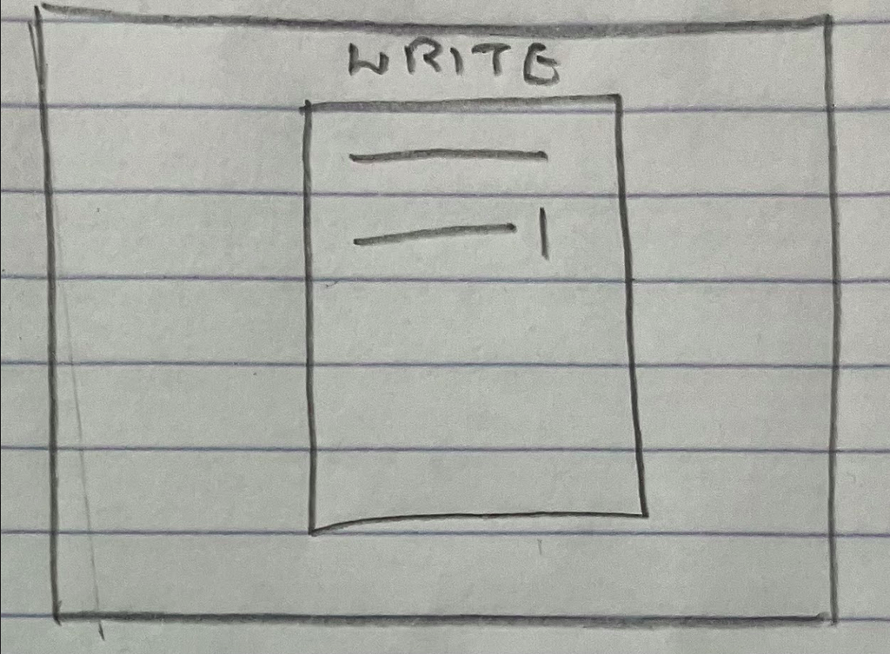
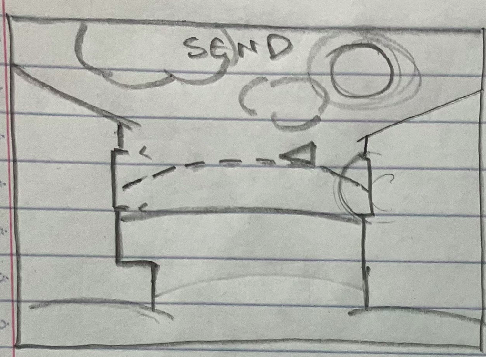
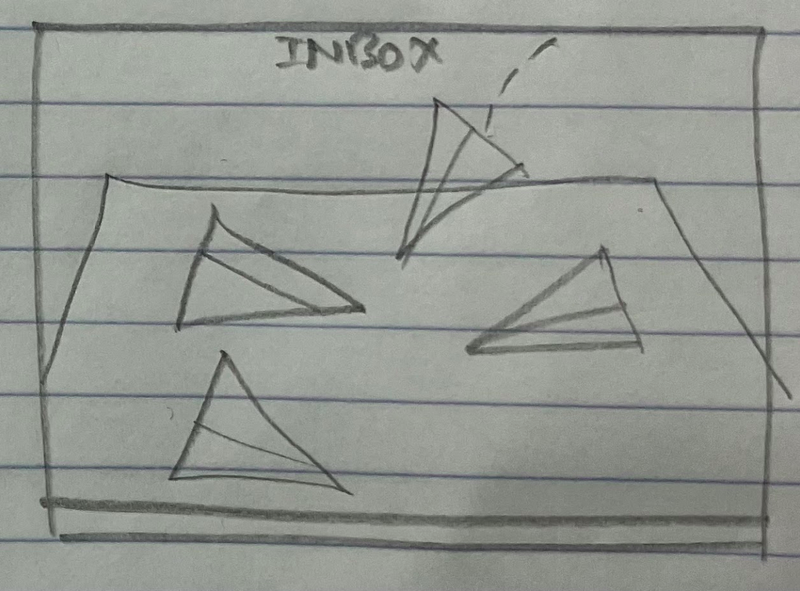
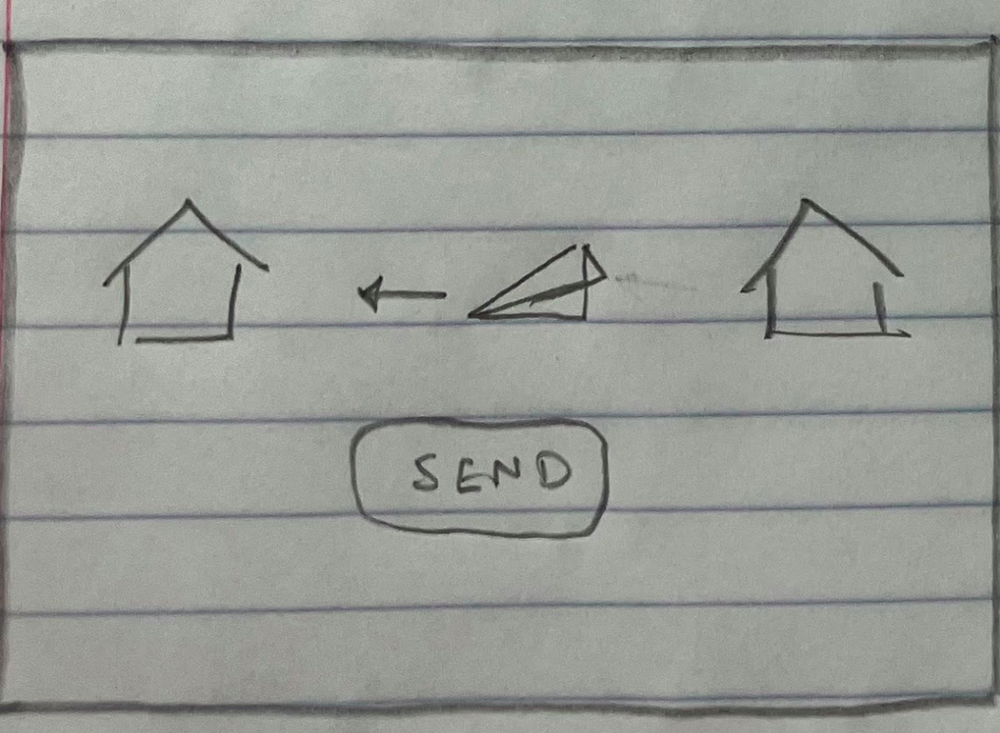
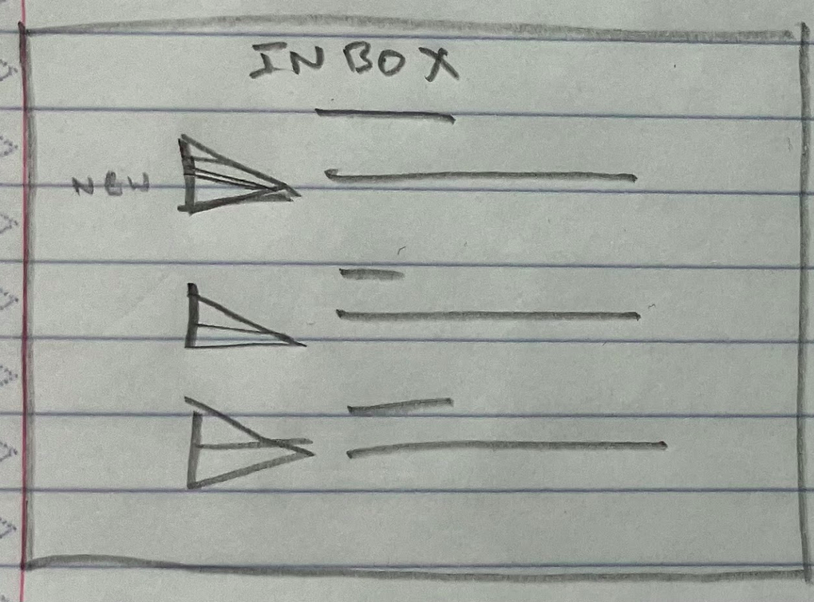

# Your startup name here

[My Notes](notes.md)

> *I still need to write a description.*

## 🚀 Specification Deliverable

- [x] Proper use of Markdown
- [x] A concise and compelling elevator pitch
- [x] Description of key features
- [x] Description of how you will use each technology
- [x] One or more rough sketches of your application. Images must be embedded in this file using Markdown image references.

### Elevator pitch
Sometimes texting is your only good option for sending a friend a nice note, short of mailing a letter. The Sincerely messaging app provides an alternative option: write them a virtual nice letter, but instead of texting or mailing it you fold it up into a paper airplane and throw it (angry-birds style) into their window!

### Design  
Main app pages are sketched below:  
  
  
  

These Send Message and Inbox pages could take more work. More minimal versions might look like this:
  

### Key features
- Unique user accounts
- Search for friends
- Send friend requests and messages via paper airplane game
- View inbox

### Technologies
- **HTML** - 5 pages maximun: login/registration, main menu, searching for friends, throwing a message, and the user's inbox.
- **CSS** - Minimum viable product involves an organized interface for writing, sending, and viewing messages. More CSS and Javascript work would involve having an aesthetic minigame feel and interactivity.
- **React** - Components to divide the app into modules. Critical backbone for organization of code.
- **Service** - Backend has endpoints for:
    - login/registration
    - sending messages
    - retrieving messages
    - etc.

    API call is made to get local weather and time. This influences the backdrop art on the airplane throwing scene.
- **Database** - User messages are stored on the server between sessions.
- **Websocket** - New messages are sent and become visible to the receiver in real time.

## 🚀 AWS deliverable

- [x] **Server deployed and accessible with custom domain name** - [leeway001.click](https://leeway001.click).

## 🚀 HTML deliverable

For this deliverable I did the following. I checked the box `[x]` and added a description for things I completed.

- [x] **HTML pages** - 4 pages
- [x] **Proper HTML element usage** - Included `header`, `nav`, `body`, `main`, and `footer` tags
- [x] **Links** - Links to each page in header nav
- [x] **Text** - Filler text
- [x] **3rd party API placeholder** - Weather API call will change sky color on send page
- [x] **Images** - Included
- [x] **Login placeholder** - On index.html
- [x] **DB data placeholder** - On inbox (messages stored on database)
- [x] **WebSocket placeholder** - On inbox (messages update live, `NEW` tag)

## 🚀 CSS deliverable

For this deliverable I did the following. I checked the box `[x]` and added a description for things I completed.

- [X] **Header, footer, and main content body** - Unique per page
- [x] **Navigation elements** - Took surprisingly long since I used Boostrap for the first time here.
- [x] **Responsive to window resizing** - Nav bar and Inbox page needed the most responsiveness. `This still needs some work`, as I tested it on a normal browser window scaled to look like a mobile phone, but forgot to try the phone dimensinos emulation via developer tools, and didn't notice the responsiveness issues until after I deployed and opened the website on my phone browser."
- [X] **Application elements** - Unique per page
- [x] **Application text content** - Different fonts for main, header and footer.
- [x] **Application images** - Arranging images with CSS was difficult.

## 🚀 React part 1: Routing deliverable

For this deliverable I did the following. I checked the box `[x]` and added a description for things I completed.

- [x] **Bundled using Vite** - I think I did this right
- [x] **Components** - I have done this before
- [x] **Router** - New to me, but easy enough

## 🚀 React part 2: Reactivity deliverable

For this deliverable I did the following. I checked the box `[x]` and added a description for things I completed.

- [x] **All functionality implemented or mocked out** - Some bugs yet to be worked out, but overall functionality is intact.
- [x] **Hooks**

#### Functionality to add:
- [X] Login page unauth & auth modes
- [x] Inbox: Messages appear `websocket`
- [x] Inbox: Messages clickable & readable (`state` determines which one)
- [x] Inbox: New messages have "new" badge (`state`)
- [X] Inbox: Messages stored in `localstorage db`
- [ ] Inbox: (Optional) hide message view when no message is selected
- [X] Write: Direct to send page
- [x] Write: Set up for message to actually be sent
- [x] Send: Throw button plays animation
- [x] Send: Fake `API` data for weather, loads with `useEffect`

## 🚀 Service deliverable

For this deliverable I did the following. I checked the box `[x]` and added a description for things I completed.

- [ ] **Node.js/Express HTTP service** - I did not complete this part of the deliverable.
- [ ] **Static middleware for frontend** - I did not complete this part of the deliverable.
- [ ] **Calls to third party endpoints** - I did not complete this part of the deliverable.
- [ ] **Backend service endpoints** - I did not complete this part of the deliverable.
- [ ] **Frontend calls service endpoints** - I did not complete this part of the deliverable.
- [ ] **Supports registration, login, logout, and restricted endpoint** - I did not complete this part of the deliverable.

## 🚀 DB deliverable

For this deliverable I did the following. I checked the box `[x]` and added a description for things I completed.

- [ ] **Stores data in MongoDB** - I did not complete this part of the deliverable.
- [ ] **Stores credentials in MongoDB** - I did not complete this part of the deliverable.

## 🚀 WebSocket deliverable

For this deliverable I did the following. I checked the box `[x]` and added a description for things I completed.

- [ ] **Backend listens for WebSocket connection** - I did not complete this part of the deliverable.
- [ ] **Frontend makes WebSocket connection** - I did not complete this part of the deliverable.
- [ ] **Data sent over WebSocket connection** - I did not complete this part of the deliverable.
- [ ] **WebSocket data displayed** - I did not complete this part of the deliverable.
- [ ] **Application is fully functional** - I did not complete this part of the deliverable.

## Known bugs
- Messages don't get marked as read in DB
- Messages should only be sent if they have a recipient and content. Disable button otherwise
- Odd abiliy to be signed in as "null" isn't good, all "null" users will see and send the same anonymous messages
- Can't open Send page manually anymore because it's looking for data from Write

## Future improvements
- [ ] Include recipient line on letter in inbox ("Dear__"), and sender line in writing page ("Sincerely, ___")
- [ ] Truncate message previews in Inbox
- [ ] Message management: delete messages, reply, etc.
- [ ] MUCH better visuals:
    - [ ] More playable (drag-and-throw)
    - [ ] Folding paper airplane
    - [ ] More graphical inbox?